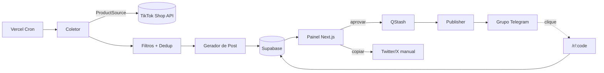

# Mother

> Bot de curadoria e divulgação automatizada de ofertas do TikTok Shop para Telegram e Twitter/X.

**Mother** coleta produtos do TikTok Shop periodicamente, aplica regras de curadoria, gera posts prontos e os coloca numa fila de aprovação. Você revisa em um painel web; ao aprovar, o post vai automaticamente para o grupo do Telegram. O post do Twitter/X é gerado junto, mas fica no painel para publicação manual — a API do X é paga.

Todo link publicado passa por um encurtador próprio, o que permite medir cliques por post e descobrir o que realmente converte.

---

## Índice da documentação

| Documento | Conteúdo |
|---|---|
| [`docs/SRS.md`](docs/SRS.md) | Especificação de requisitos — índice das 7 seções em [`docs/srs/`](docs/srs/) |
| [`docs/ARCHITECTURE.md`](docs/ARCHITECTURE.md) | Arquitetura C4, componentes, fluxos, restrições do serverless, riscos |
| [`docs/DATA_MODEL.md`](docs/DATA_MODEL.md) | Modelo de dados, DDL, índices, RLS, máquina de estados |
| [`docs/API_INTEGRATION.md`](docs/API_INTEGRATION.md) | Integrações externas: TikTok Shop, Telegram, QStash, Supabase |
| [`docs/CONTENT_TEMPLATES.md`](docs/CONTENT_TEMPLATES.md) | Templates de post, variáveis, escaping, limites de caractere |
| [`docs/SETUP.md`](docs/SETUP.md) | Variáveis de ambiente, provisionamento e deploy |
| [`docs/ROADMAP.md`](docs/ROADMAP.md) | Fases de entrega, definição de MVP, backlog |
| [`docs/adr/`](docs/adr/) | Architecture Decision Records |

---

## Como funciona



1. **Coleta** — um cron dispara a busca de produtos na fonte configurada.
2. **Curadoria** — filtros por desconto mínimo, faixa de preço, avaliação, categoria e vendas descartam o que não serve.
3. **Deduplicação** — produto já publicado só volta à fila depois da janela de reposição, ou antes dela se o preço tiver caído.
4. **Geração** — para cada produto aprovado nos filtros são gerados dois textos: um para Telegram, um para Twitter/X.
5. **Aprovação** — o post entra na fila do painel com status `PENDING`. Nada é publicado sem sua ação.
6. **Publicação** — ao aprovar, o job entra no QStash, que chama a função de publicação; ela envia ao grupo do Telegram e marca o post como publicado.
7. **Twitter/X** — o texto fica no painel com botão de copiar; você posta e marca como publicado manualmente.
8. **Rastreamento** — o link curto registra cada clique antes de redirecionar ao destino de afiliado.

---

## Stack

| Camada | Tecnologia | Motivo |
|---|---|---|
| Painel web | Next.js (App Router) + TypeScript | Renderização e deploy nativos no Vercel |
| API / lógica de negócio | Python 3.12 + FastAPI (serverless) | Linguagem escolhida para o domínio e integrações |
| Banco de dados | Supabase (PostgreSQL) | Postgres gerenciado com Auth e RLS incluídos |
| Autenticação | Supabase Auth (magic link) | Login sem senha, sem gerenciar credenciais |
| Fila / jobs | Upstash QStash + Redis | Entrega por HTTP push, compatível com serverless |
| Agendamento | Vercel Cron | Nativo da plataforma, sem infraestrutura extra |
| Hospedagem | Vercel | Deploy por git push, custo inicial zero |

> **Restrição fundamental:** o Vercel é serverless e não mantém processos longos. Por isso o Telegram opera por **webhook** (nunca long polling), o agendamento usa **Vercel Cron** (nunca APScheduler em memória) e a fila usa **push HTTP via QStash** (nunca um worker que fica escutando Redis). Ver [ADR-0002](docs/adr/0002-plataforma-serverless-vercel.md).

---

## Estrutura de pastas

Repositório único com backend e frontend separados por pasta, publicados como um projeto só. A justificativa de cada pasta está na [seção 0 da arquitetura](docs/architecture/00-estilo-arquitetural.md).

```
mother/
├── docs/
├── backend/                      # Python — hexagonal + pipeline
│   ├── api/                      #   adaptadores primários: endpoints, cron, webhook
│   ├── src/
│   │   ├── domain/               #   núcleo: modelos e regras, sem dependências
│   │   ├── pipeline/             #   orquestrador + estágios (collect, curate, generate, publish)
│   │   ├── services/             #   PostService, ShortenerService, MetricsService
│   │   ├── ports/                #   interfaces: ProductSource, Publisher, JobQueue, Repository
│   │   └── adapters/             #   implementações: TikTok, Telegram, QStash, Supabase
│   ├── tests/
│   └── requirements.txt
├── frontend/                     # Next.js — painel de administração
│   ├── app/                      #   login, queue, twitter, failed, rules, analytics, runs
│   ├── components/
│   ├── lib/
│   └── package.json
├── supabase/migrations/
├── vercel.json                   # rotas, runtimes e crons
└── .env.example
```

**Regra de dependência do backend:** `api/` → `pipeline/` → `domain/` e `ports/`. Os adaptadores implementam as portas e nunca são importados pelo domínio. Nenhum arquivo em `domain/` ou `pipeline/stages/` importa cliente de rede.

---

## Quickstart

```bash
git clone <repo> mother && cd mother

# Dependências Python
python -m venv .venv && source .venv/bin/activate
pip install -r requirements.txt

# Dependências do painel
cd web && npm install && cd ..

# Configuração
cp .env.example .env.local   # preencher: ver docs/SETUP.md

# Banco
supabase db push

# Desenvolvimento (roda API Python e painel juntos)
vercel dev
```

O passo a passo completo — criar o bot no BotFather, obter as credenciais do TikTok, provisionar Supabase e Upstash, registrar o webhook e configurar os crons — está em [`docs/SETUP.md`](docs/SETUP.md).

---

## Estado do projeto

| Fase | Situação |
|---|---|
| Documentação | Em andamento |
| Fonte de dados TikTok definida | Pendente — ver [ADR-0001](docs/adr/0001-fonte-de-dados-tiktok-shop.md) |
| Implementação | Não iniciada |

**Bloqueio externo conhecido:** o acesso à API do TikTok Shop depende de aprovação de aplicação no TikTok Shop Partner Center, cujo prazo não está sob controle do projeto. O `ProductSource` foi desenhado como interface justamente para permitir desenvolver e testar tudo o mais com uma implementação `MockSource` enquanto a aprovação não sai.

---

## Escopo

**Faz parte:** coleta de produtos, curadoria por regras, deduplicação, geração de posts, fila de aprovação, publicação automática no Telegram, fila manual para Twitter/X, encurtador com contagem de cliques, painel de administração.

**Não faz parte:** publicação automática no Twitter/X (API paga), geração de imagens ou cards, atendimento a usuários no Telegram, processamento de pedidos ou pagamentos, aplicativo móvel.

---

## Licença

A definir.
