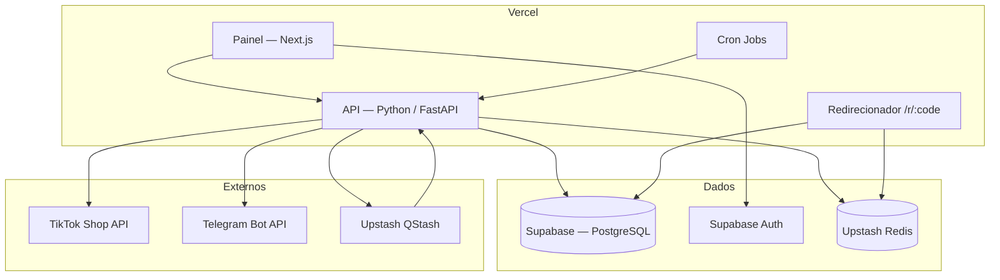

# Arquitetura — Mother

**Versão:** 1.0 · **Data:** 2026-08-08 · **Status:** Rascunho para revisão

Este documento descreve *como* o sistema é construído. O *que* ele deve fazer está no [SRS](SRS.md). Decisões pontuais com alternativas avaliadas estão nos [ADRs](adr/).

Dividido em seções independentes, no mesmo padrão do SRS.

---

## Seções

| # | Documento | Conteúdo |
|---|---|---|
| 0 | [Estilo arquitetural](architecture/00-estilo-arquitetural.md) | Hexagonal + pipeline, regra de dependência, estrutura de pastas |
| 1 | [Visão C4](architecture/01-visao-c4.md) | Contexto, contêineres e componentes |
| 2 | [Componentes](architecture/02-componentes.md) | Responsabilidade e contrato de cada módulo |
| 3 | [Fluxos](architecture/03-fluxos.md) | Diagramas de sequência dos cinco fluxos principais |
| 4 | [Restrições do serverless](architecture/04-restricoes-serverless.md) | O que muda por não haver processo longo, e como contornar |
| 5 | [Segurança e observabilidade](architecture/05-seguranca-observabilidade.md) | Superfície de ataque, controles, registros e alertas |

---

## Resumo em uma página

**Estilo arquitetural:** arquitetura hexagonal (Ports & Adapters) com o domínio organizado como pipeline (Pipes and Filters), executada em funções serverless, com um ponto de controle humano no meio. Detalhado na [seção 0](architecture/00-estilo-arquitetural.md).

### Princípios que guiam as decisões

1. **Nada depende de processo longo.** É a restrição RE-01 e determina webhook, cron e fila por push. Ver [ADR-0002](adr/0002-plataforma-serverless-vercel.md).
2. **Todo estado é externo.** Funções são descartáveis; a verdade vive no Postgres e no Redis.
3. **O caminho do dinheiro nunca falha por causa de métrica.** O redirecionamento responde antes de registrar o clique.
4. **A fonte de dados é substituível.** `ProductSource` isola o único ponto do sistema cujo acesso não está garantido.
5. **Operações externas são idempotentes.** Reentrega de job não gera post duplicado.
6. **Falha de item não derruba o lote.** Um produto malformado não interrompe a coleta.

### Decisões estruturais

| Decisão | Escolha | ADR |
|---|---|---|
| Fonte de produtos | Abstração `ProductSource`, implementação a definir | [ADR-0001](adr/0001-fonte-de-dados-tiktok-shop.md) |
| Plataforma de execução | Vercel serverless | [ADR-0002](adr/0002-plataforma-serverless-vercel.md) |
| Fila de publicação | Upstash QStash por push HTTP | [ADR-0003](adr/0003-fila-qstash-push-http.md) |
| Divisão de runtimes | Next.js no painel, Python na API | [ADR-0004](adr/0004-stack-hibrida-python-nextjs.md) |
| Mídia dos posts | Somente texto | [ADR-0005](adr/0005-posts-somente-texto.md) |
| Rastreamento de links | Encurtador próprio | [ADR-0006](adr/0006-encurtador-proprio.md) |
| Aprovação | Humana e obrigatória | [ADR-0007](adr/0007-aprovacao-humana-obrigatoria.md) |

### O que esta arquitetura assume e onde ela quebra

| Assumido | Limite | Quando repensar |
|---|---|---|
| Centenas de produtos por coleta | Milhares exigiriam fatiar em múltiplas invocações encadeadas | PR-02 se mostrar falsa |
| Um único canal de Telegram | Multi-canal exigiria tabela de destinos e roteamento no publisher | Ao adicionar o segundo canal |
| Um administrador | Concorrência na fila não é tratada com trava | Ao adicionar o papel de Revisor (AT-02) |
| Milhares de cliques por mês | Registro clique a clique não escala indefinidamente | Ao aproximar de 100 mil cliques/mês |
| Publicação apenas em Telegram e X | Novos canais exigem apenas nova implementação de `Publisher` | Já previsto pela interface |

---

## Documentos relacionados

- [`SRS.md`](SRS.md) — requisitos
- [`DATA_MODEL.md`](DATA_MODEL.md) — esquema do banco
- [`API_INTEGRATION.md`](API_INTEGRATION.md) — contratos externos
- [`SETUP.md`](SETUP.md) — provisionamento e deploy
