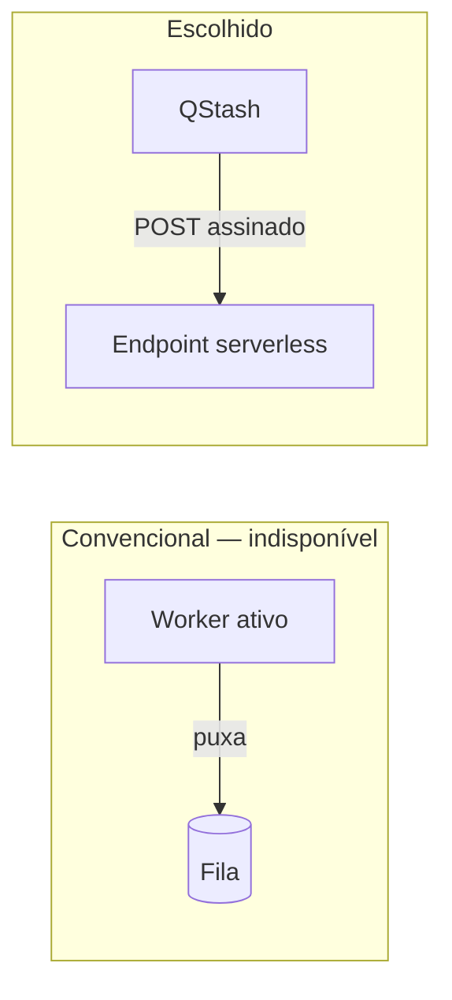

# ADR-0003 — Usar QStash com entrega por push HTTP

**Status:** Aceito
**Data:** 2026-08-08
**Decisores:** isaac

## Contexto

A publicação no Telegram não pode acontecer durante a requisição de aprovação. Se acontecesse:

- O Administrador esperaria pela resposta do Telegram para ver a confirmação (violando RNF-005)
- Uma falha temporária do Telegram viraria erro na tela, e não retentativa
- Aprovação em lote multiplicaria o tempo de resposta pelo número de posts
- Não haveria como agendar publicação para horário futuro (RF-026)

Portanto é preciso um mecanismo assíncrono: a aprovação registra a intenção, algo mais tarde executa.

O problema é que [ADR-0002](0002-plataforma-serverless-vercel.md) eliminou o padrão convencional. Filas como Celery, RQ ou BullMQ pressupõem um **worker**: um processo que fica escutando a fila e consumindo mensagens. Não existe onde rodar esse processo.

## Decisão

**Usar Upstash QStash, que inverte a relação: em vez de o sistema puxar da fila, a fila empurra para um endpoint HTTP do sistema.**

| Operação | Como funciona |
|---|---|
| Enfileirar | `POST` à API do QStash com a URL de destino e o corpo do job |
| Entregar | O QStash chama a URL, com assinatura no cabeçalho |
| Retentar | Automático, com espera exponencial |
| Agendar | Parâmetro de atraso na publicação do job |
| Falha final | Fila de mensagens mortas |

O endpoint comunica sua intenção ao QStash pelo código de resposta HTTP: 2xx encerra o job; 4xx e 5xx provocam retentativa.

## Alternativas consideradas

### A) Publicar de forma síncrona na aprovação

**Prós:** sem infraestrutura adicional; o resultado é imediato e visível.
**Contras:** viola RNF-005; falha temporária vira erro de usuário; aprovação em lote fica inviável; sem agendamento; sem retentativa.
**Rejeitada** por não atender aos requisitos de resposta e confiabilidade.

### B) Tabela de fila no Postgres com cron consumindo

**Prós:** sem serviço adicional; transacional com o resto dos dados — a inconsistência da seção 4.8 da arquitetura desapareceria.
**Contras:** latência limitada pela granularidade do cron, que é de minutos, comprometendo o prazo de 60 s de RNF-006; retentativa e espera exponencial teriam que ser implementadas à mão; exige controle de concorrência para não processar o mesmo item duas vezes; consome cota de tarefas agendadas.
**Rejeitada** pela latência e pelo volume de mecanismo a construir. Continua sendo o plano B mais razoável caso o QStash se torne inviável.

### C) Worker separado em outro provedor

**Prós:** modelo convencional de fila, com todas as bibliotecas maduras disponíveis.
**Contras:** reintroduz um processo para administrar e um custo fixo, anulando parte do motivo de ADR-0002; mais um lugar para falhar e monitorar.
**Rejeitada** por contrariar a premissa de zero administração.

### D) QStash com push HTTP — **escolhida**

**Prós:** desenhado para serverless; retentativa, espera exponencial, agendamento e fila de mensagens mortas prontos; assinatura de requisição incluída; camada gratuita suficiente para o volume previsto; sem processo para administrar.
**Contras:** dependência de mais um serviço externo; entrega **ao menos uma vez**, o que torna idempotência obrigatória; não participa da transação do banco; depuração menos direta que uma fila local.
**Aceita** porque entrega tudo que uma fila precisa ter sem exigir um processo que não existe.

## Consequências

### Positivas

- Aprovação responde imediatamente; a publicação acontece depois (RNF-005)
- Retentativa com espera exponencial sem código próprio (RNF-011)
- Agendamento de publicação futura sai de graça (RF-026)
- Falhas persistentes ficam retidas na fila de mensagens mortas, não se perdem
- A assinatura das requisições resolve a autenticação do endpoint (RF-035)

### Negativas

- **Idempotência deixa de ser refinamento e vira requisito.** Entrega ao menos uma vez significa que o mesmo job pode chegar duas vezes; sem verificação de chave, o grupo receberia mensagens duplicadas (RF-034, RNF-015)
- O endpoint de publicação fica exposto na internet, dependendo da validação de assinatura para não ser acionado por terceiros
- Não há transação entre a alteração de status e o enfileiramento; exige reversão em caso de falha e reconciliação periódica (RF-027, RNF-014)
- Mais um serviço no inventário de dependências e de segredos

### Neutras

- O código de resposta HTTP passa a ter significado de protocolo, não apenas de resultado. Erro permanente responde 200 deliberadamente, para interromper retentativas inúteis
- A interface `JobQueue` isola o QStash, deixando aberta a migração para a alternativa B se necessário

## Requisitos afetados

RF-026, RF-027, RF-033, RF-034, RF-035, RF-037, RN-022, RNF-005, RNF-006, RNF-011, RNF-014, RNF-015

## Revisão

Reavaliar quando:

- O volume de jobs exceder a camada gratuita do QStash
- A inconsistência entre banco e fila causar problema recorrente na prática, favorecendo a alternativa B
- Surgir necessidade de ordenação estrita entre jobs, que o QStash não garante
