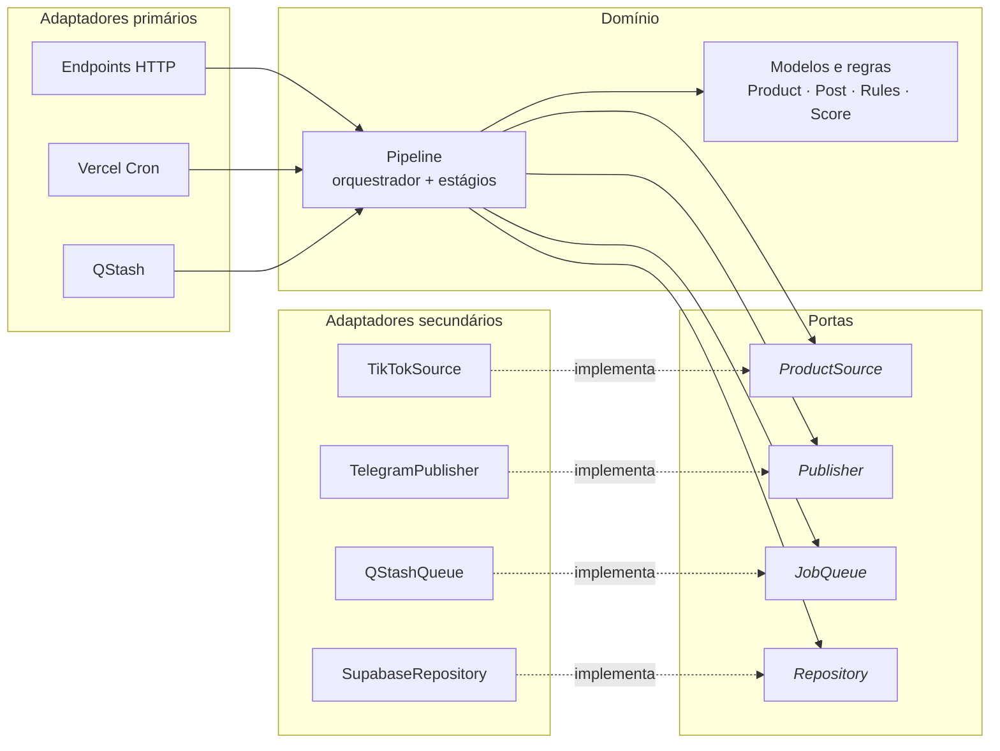
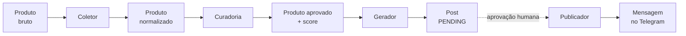

[Índice da Arquitetura](../ARCHITECTURE.md) | Próximo: [1. Visão C4 →](01-visao-c4.md)

---

# 0. Estilo Arquitetural

O backend combina **dois** estilos. Eles não competem: resolvem perguntas perpendiculares e se sobrepõem sem conflito.

| Estilo | Também chamado de | Pergunta que responde | Direção |
|---|---|---|---|
| **Ports & Adapters** | Arquitetura Hexagonal | Quem pode depender de quem? | Para dentro |
| **Pipes and Filters** | Pipeline | Em que ordem o dado é processado? | Para frente |

Na mesma família da Hexagonal estão a Clean Architecture e a Onion Architecture. Mudam no vocabulário e no número de camadas, mas partilham a mesma regra central. Este projeto usa o vocabulário de portas e adaptadores por ser o mais direto.

**Como descrever o backend em uma frase:** arquitetura hexagonal, com o domínio organizado como pipeline.

---

## 0.1 Por que dois estilos

Cada um sozinho deixa um problema em aberto.

**Pipeline sem hexagonal** produz estágios que chamam a API do TikTok e o Telegram diretamente. Funciona, mas nada é testável sem rede e sem credenciais, e trocar a fonte de dados vira reescrita — exatamente o risco que [ADR-0001](../adr/0001-fonte-de-dados-tiktok-shop.md) existe para eliminar.

**Hexagonal sem pipeline** é qualquer aplicação CRUD bem estruturada. Não diz nada sobre a sequência de transformação que o produto atravessa, que é justamente a lógica central deste sistema.

O projeto precisa dos dois porque tem simultaneamente uma sequência de processamento e uma dependência externa cujo acesso não está garantido.

---

## 0.2 Ports & Adapters — a regra de dependência

Uma regra única governa toda a estrutura:

> **A dependência aponta sempre para dentro. O domínio não conhece o mundo externo.**



Repare no sentido das setas do lado direito. O pipeline **usa** `ProductSource`. `TikTokSource` **implementa** `ProductSource`. Nenhum arquivo do domínio contém `import TikTokSource`.

Consequência prática: é possível apagar `TikTokSource` inteiro e o domínio continua compilando e passando nos testes. É isso que ADR-0001 comprou, e é o que permite desenvolver o sistema completo antes de ter acesso à API real.

### Os dois lados do hexágono

Distinção que costuma passar batida e gera excesso de código quando ignorada.

| Lado | Nome | Quem é | Precisa de interface? |
|---|---|---|---|
| **Esquerdo** | Portas primárias (*driving*) | Quem **chama** a aplicação: endpoints, cron, webhook, fila | **Não** |
| **Direito** | Portas secundárias (*driven*) | Quem a aplicação **chama**: TikTok, Telegram, banco, Redis | **Sim** |

Só o lado direito precisa de abstração, porque é ele que representa dependência externa substituível e difícil de testar. O lado esquerdo já é o adaptador: o endpoint chama o serviço do domínio diretamente. Criar interface para o lado esquerdo é cerimônia que não paga nada.

**Resumo:** `api/` é o lado esquerdo. `adapters/` é o lado direito. Só o segundo tem correspondente em `ports/`.

---

## 0.3 Pipes and Filters — o fluxo do dado

O produto atravessa estágios em sequência. Cada estágio transforma e passa adiante, sem saber quem vem depois.



### Propriedades que justificam o estilo

**Cada estágio é testável isoladamente.** A Curadoria recebe uma lista de produtos e devolve uma lista filtrada. Não acessa rede, não escreve em lugar nenhum. Testar exige uma lista em memória e nada mais. É por isso que RNF-032 concentra a exigência de cobertura justamente aqui: é onde a regra de negócio é densa e o teste é barato.

**Um estágio não conhece o outro.** O Coletor ignora a existência do Telegram. O Gerador ignora de onde veio o produto. Isso permite reaproveitar Curadoria e Gerador na reavaliação de preços (UC-15) sem nenhuma adaptação.

**O fluxo pode ser interrompido e retomado.** É exatamente o que a aprovação humana faz: o pipeline roda até `PENDING`, persiste e para. Horas depois, outra invocação retoma do estágio seguinte. Sem essa propriedade, a aprovação manual seria uma interrupção improvisada no meio de um fluxo contínuo — e no modelo serverless, onde nada sobrevive entre invocações, ela é obrigatória de todo modo.

### O orquestrador

O erro comum em pipeline é cada estágio chamar o próximo: o Coletor invocando a Curadoria, que invoca o Gerador. Isso os faz se conhecerem de novo, e o desacoplamento se perde.

A solução é um **orquestrador** fino, que chama os estágios em ordem e repassa o resultado:

```python
def run_collection(rules: Rules, budget: TimeBudget) -> RunResult:
    raw     = collect(source, cursor, budget)   # I/O: rede + banco
    curated = curate(raw, rules)                # puro
    posts   = generate(curated, templates)      # puro
    repo.save_posts(posts)                      # I/O: banco
    return RunResult(...)
```

Os estágios continuam ignorantes uns dos outros. Quem conhece a sequência é o orquestrador, e só ele.

### Onde o pipeline persiste

Decisão registrada aqui porque é frequentemente questionada: **os estágios comunicam-se em memória, não pelo banco.**

```
[Coletor] ──── grava produtos ────>  (RF-004, obrigatório)
    │
[Curadoria]    em memória — CPU puro, milissegundos
    │
[Gerador]      em memória — CPU puro, milissegundos
    │
    └───────── grava posts ────────>  (fim da fase)
```

O único trabalho caro e irrecuperável é a chamada de rede à fonte, e o Coletor já a persiste porque o requisito exige. Se a função morrer durante a Curadoria, nada se perde: os produtos estão no banco e reexecutar custa milissegundos de processamento sobre dados já salvos.

Persistir também entre Curadoria e Gerador exigiria estado intermediário próprio — uma coluna de situação de curadoria, com seus estados travados e uma rotina de varredura para órfãos. Seria uma segunda máquina de estados para manter, além da do post (RN-017), em troca de proteger um trabalho que custa quase nada refazer. Some-se o custo de conexão: no modelo serverless com pooler em modo transação, cada ida ao banco pesa.

**Quando a decisão inversa seria correta:** se algum estágio intermediário fosse caro ou externo — uma pontuação por modelo de linguagem, por exemplo. Não é o caso: o score é aritmética com quatro pesos.

O desenho é, portanto, híbrido: **persiste onde o trabalho é caro, passa em memória onde é barato.**

---

## 0.4 Estrutura de pastas

Repositório único, com backend e frontend separados por pasta, publicados como um único projeto na plataforma.

```
mother/
├── docs/
├── backend/
│   ├── api/                      ← ADAPTADORES PRIMÁRIOS (lado esquerdo)
│   │   ├── index.py              #   entrypoint ASGI
│   │   ├── cron/
│   │   │   ├── collect.py
│   │   │   ├── refresh_prices.py
│   │   │   ├── expire_pending.py
│   │   │   └── aggregate_metrics.py
│   │   ├── jobs/publish.py
│   │   ├── webhooks/telegram.py
│   │   ├── routes/               #   posts, rules, metrics
│   │   └── r/[code].py           #   redirecionador
│   ├── src/
│   │   ├── domain/               ← NÚCLEO
│   │   │   ├── product.py        #   modelos e invariantes
│   │   │   ├── post.py           #   inclui a máquina de estados (RN-017)
│   │   │   ├── rules.py
│   │   │   └── errors.py
│   │   ├── pipeline/             ← APLICAÇÃO
│   │   │   ├── orchestrator.py
│   │   │   └── stages/
│   │   │       ├── collect.py
│   │   │       ├── curate.py     #   puro: lista entra, lista sai
│   │   │       ├── generate.py   #   puro
│   │   │       └── publish.py
│   │   ├── services/             #   PostService, ShortenerService, MetricsService
│   │   ├── ports/                ← FRONTEIRA (interfaces)
│   │   │   ├── product_source.py
│   │   │   ├── publisher.py
│   │   │   ├── job_queue.py
│   │   │   └── repository.py
│   │   ├── adapters/             ← ADAPTADORES SECUNDÁRIOS (lado direito)
│   │   │   ├── sources/          #   tiktok_official, tiktok_affiliate, mock
│   │   │   ├── publishers/       #   telegram, twitter_queue
│   │   │   ├── queue/            #   qstash
│   │   │   └── repositories/     #   supabase
│   │   ├── config.py
│   │   └── time_budget.py
│   ├── tests/
│   │   ├── unit/                 #   domain e stages puros — sem rede
│   │   ├── integration/          #   adapters — com serviços simulados
│   │   └── fixtures/
│   └── requirements.txt
├── frontend/
│   ├── app/
│   │   ├── (auth)/login/
│   │   ├── queue/
│   │   ├── twitter/
│   │   ├── failed/
│   │   ├── rules/
│   │   ├── analytics/
│   │   └── runs/
│   ├── components/
│   ├── lib/                      #   cliente da API, sessão
│   └── package.json
├── supabase/migrations/
├── vercel.json                   #   rotas, runtimes e crons
└── .env.example
```

### Correspondência entre pasta e conceito

| Pasta | Papel no hexágono | Depende de | Pode ser descartada? |
|---|---|---|---|
| `backend/api/` | Adaptador primário | `src/` | Sim — trocar de plataforma reescreve só isto |
| `backend/src/pipeline/` | Aplicação | `domain/`, `ports/` | Não |
| `backend/src/domain/` | Núcleo | Nada | Não — é o sistema |
| `backend/src/ports/` | Fronteira | `domain/` | Não |
| `backend/src/adapters/` | Adaptador secundário | `ports/`, `domain/` | Sim — é o que ADR-0001 protege |
| `frontend/` | Cliente | API por HTTP | Sim |

A coluna final é o resumo do valor da arquitetura: as partes descartáveis são exatamente aquelas ligadas a serviços externos e a decisões de plataforma — as que têm maior probabilidade de mudar.

---

## 0.5 Como verificar se a regra foi violada

Teste mecânico, aplicável em revisão de código ou em verificação automatizada:

> Abrir qualquer arquivo em `src/domain/` ou `src/pipeline/stages/` e procurar `import` de biblioteca externa. Encontrar `httpx`, `supabase`, `telegram`, `redis` ou qualquer cliente de rede significa que a regra foi quebrada.

A única exceção legítima é `collect.py`, que orquestra chamadas — mas mesmo ele acessa a rede apenas através da porta `ProductSource`, jamais importando um cliente HTTP diretamente.

### Sinais de erosão

| Sintoma | O que indica |
|---|---|
| Um estágio importa outro estágio | O orquestrador foi contornado |
| `domain/` importa de `adapters/` | Inversão da regra de dependência |
| Teste unitário precisa de rede ou credencial | Alguma porta foi ignorada |
| Uma porta tem um único método usado por um único chamador | Abstração desnecessária — provavelmente do lado esquerdo |
| Regra de negócio no `frontend/` | Fronteira painel/API rompida (RNF-025) |

### Verificação automatizada sugerida

Um teste que percorre os módulos do domínio e falha se encontrar importação proibida vale mais que qualquer convenção documentada. Convenção se esquece; teste quebra a integração contínua.

---

## 0.6 Glossário do estilo

| Termo | Significado neste projeto |
|---|---|
| **Porta** | Interface que o domínio define e o mundo externo implementa |
| **Adaptador** | Implementação concreta de uma porta, ou ponto de entrada que chama o domínio |
| **Adaptador primário** *(driving)* | Quem chama a aplicação: endpoint, cron, webhook |
| **Adaptador secundário** *(driven)* | Quem a aplicação chama: TikTok, Telegram, banco |
| **Estágio** *(filter)* | Unidade de transformação do pipeline |
| **Orquestrador** | Único componente que conhece a ordem dos estágios |
| **Estágio puro** | Estágio sem entrada e saída: recebe dado, devolve dado |
| **Núcleo** | `domain/` — modelos e regras que não dependem de nada |

---

[Índice da Arquitetura](../ARCHITECTURE.md) | Próximo: [1. Visão C4 →](01-visao-c4.md)
