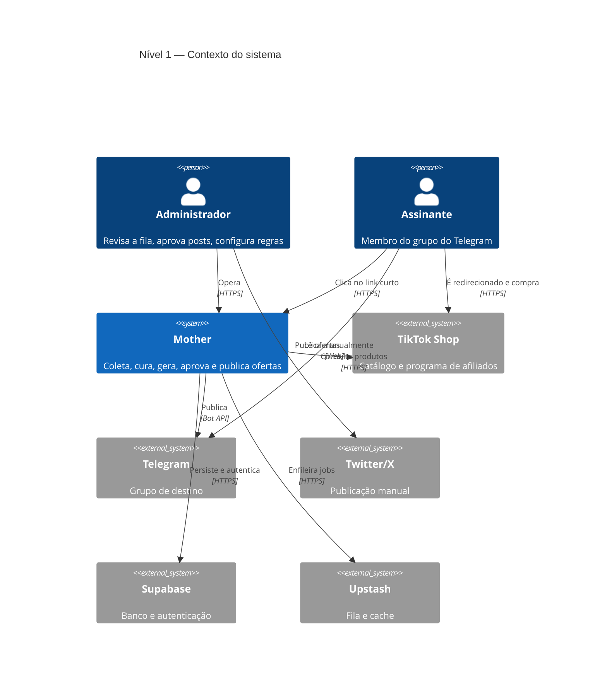
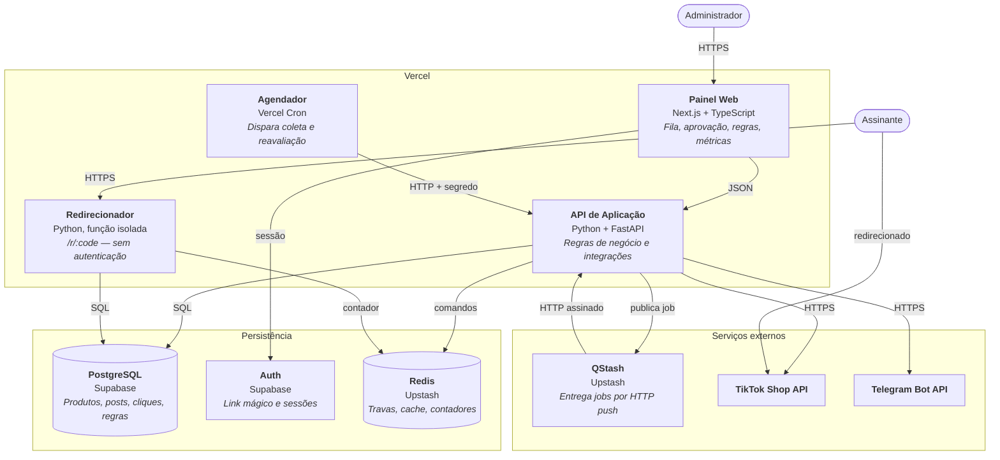
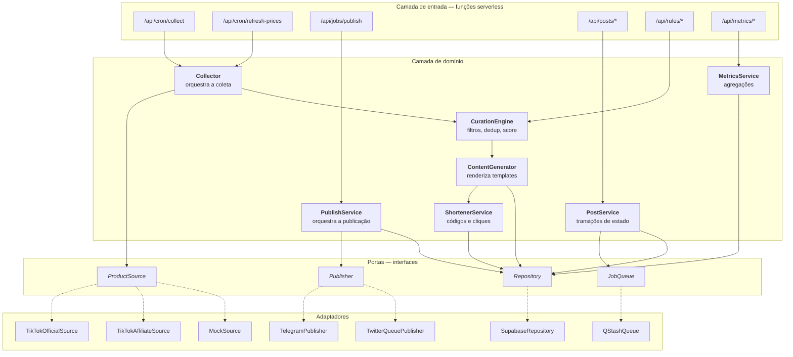

[← Índice da Arquitetura](../ARCHITECTURE.md) | Próximo: [2. Componentes →](02-componentes.md)

---

# 1. Visão C4

Três níveis: contexto (quem usa e com o que conversa), contêineres (unidades implantáveis) e componentes (módulos dentro do contêiner principal).

---

## 1.1 Nível 1 — Contexto



O sistema não expõe API pública além do redirecionador. Todo o resto exige autenticação.

---

## 1.2 Nível 2 — Contêineres



### Descrição dos contêineres

| Contêiner | Tecnologia | Responsabilidade | Não faz |
|---|---|---|---|
| **Painel Web** | Next.js (App Router), TypeScript | Renderizar telas, mediar a sessão, chamar a API | Regras de negócio, acesso direto a dados sensíveis |
| **API de Aplicação** | Python 3.12, FastAPI em funções serverless | Toda a lógica de domínio e as integrações externas | Renderizar HTML |
| **Redirecionador** | Função Python isolada | Resolver código curto, redirecionar, registrar clique | Qualquer coisa que atrase a resposta |
| **Agendador** | Vercel Cron | Invocar endpoints em horários definidos | Executar lógica |
| **PostgreSQL** | Supabase | Persistência transacional e histórica | Processamento |
| **Auth** | Supabase Auth | Emissão e validação de sessões | Autorização de negócio |
| **Redis** | Upstash | Trava de execução única, cache, contadores | Fonte de verdade |
| **QStash** | Upstash | Entregar jobs com retentativa e agendamento | Executar a publicação |

> O **Redirecionador** é um contêiner separado por decisão deliberada: é o único endpoint público, o mais sensível a latência (RNF-004) e precisa continuar funcionando mesmo que o painel esteja fora do ar (RNF-013). Isolá-lo evita que uma dependência do painel entre no seu caminho crítico.

---

## 1.3 Nível 3 — Componentes da API de Aplicação



### Regra de dependência

As setas pontilhadas representam implementação de interface. O domínio depende apenas das portas — nunca dos adaptadores. Isso é o que permite trocar `TikTokOfficialSource` por `MockSource` sem tocar em `CurationEngine`, atendendo RF-002.

```
entrada  →  domínio  →  portas  ←  adaptadores
```

Nenhuma seta aponta do domínio para fora. Um adaptador pode ser reescrito por completo sem que nenhum teste de domínio precise mudar.

---

## 1.4 Mapeamento para o repositório

| Camada | Caminho |
|---|---|
| Entrada | `api/` |
| Domínio | `src/curation/`, `src/content/`, `src/services/` |
| Portas | `src/ports/` |
| Adaptadores | `src/sources/`, `src/publishers/`, `src/queue/`, `src/repositories/` |
| Painel | `web/` |

---

[← Índice da Arquitetura](../ARCHITECTURE.md) | Próximo: [2. Componentes →](02-componentes.md)
