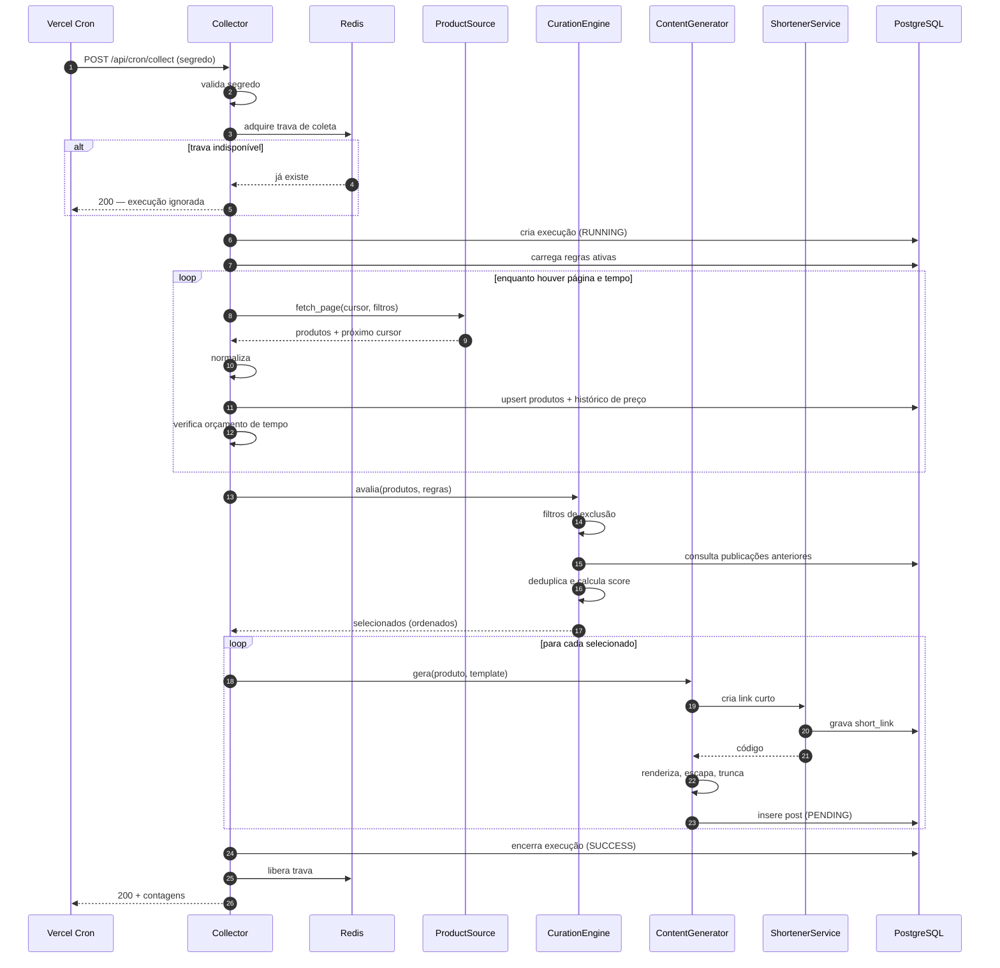
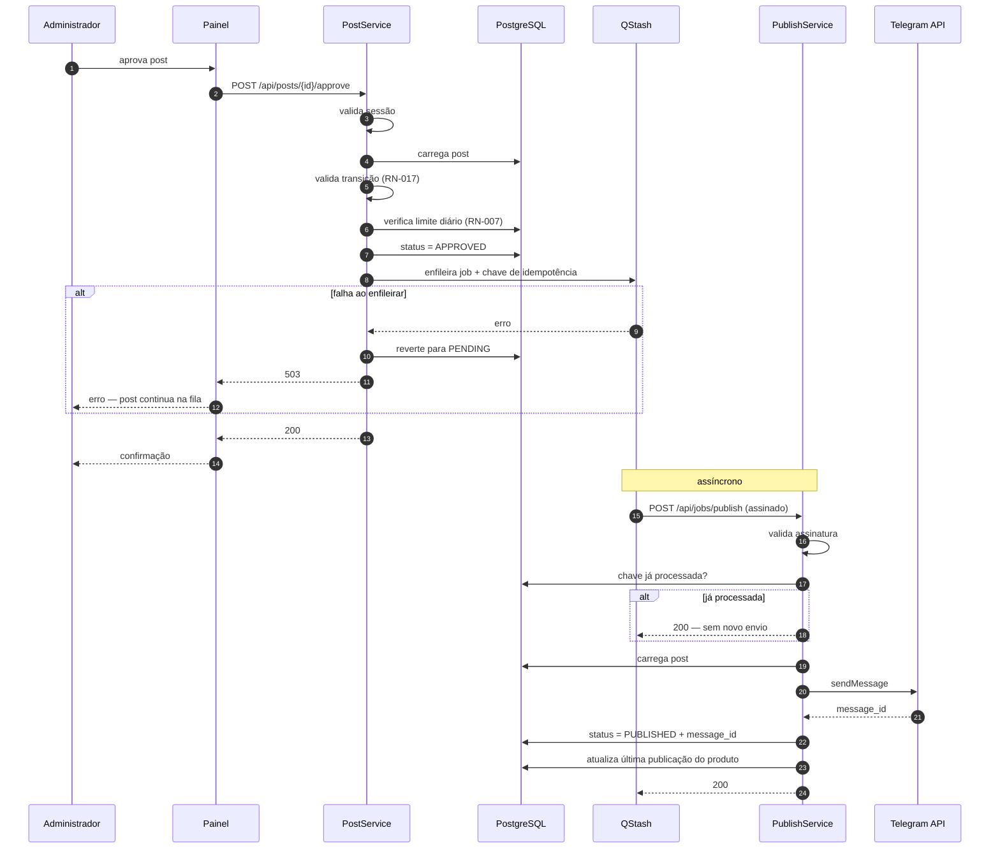
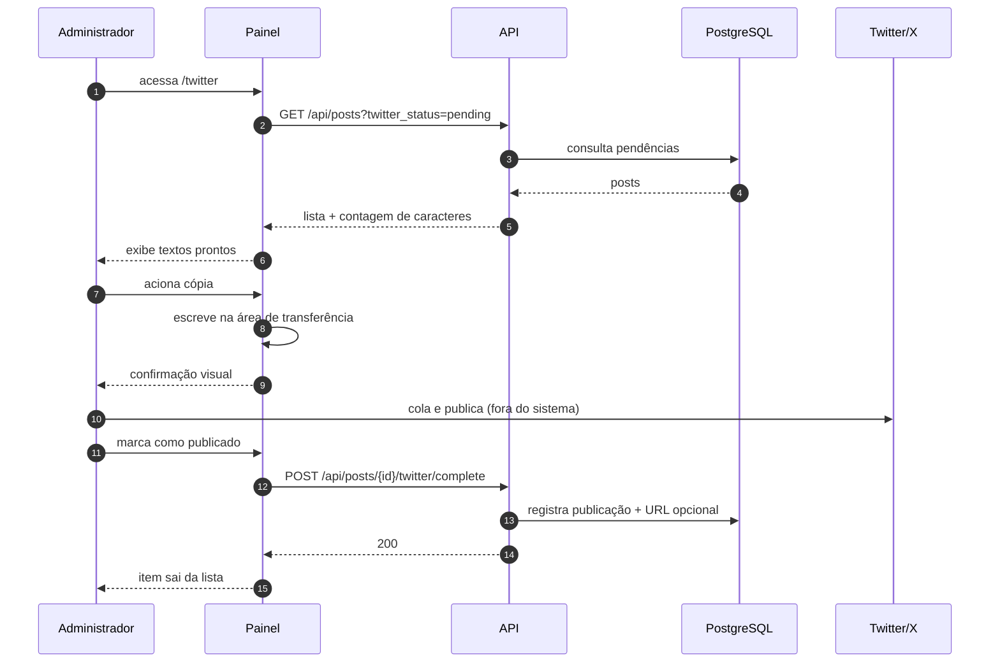
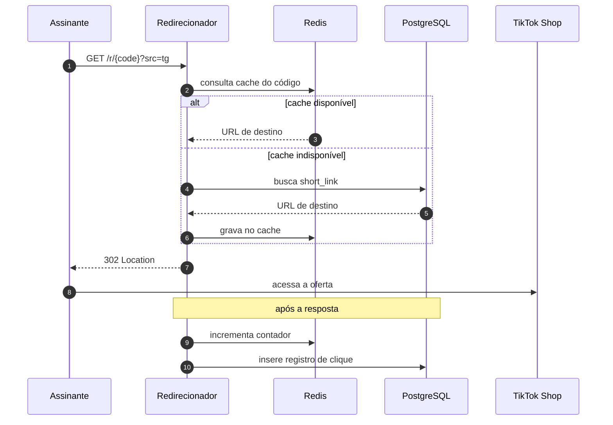
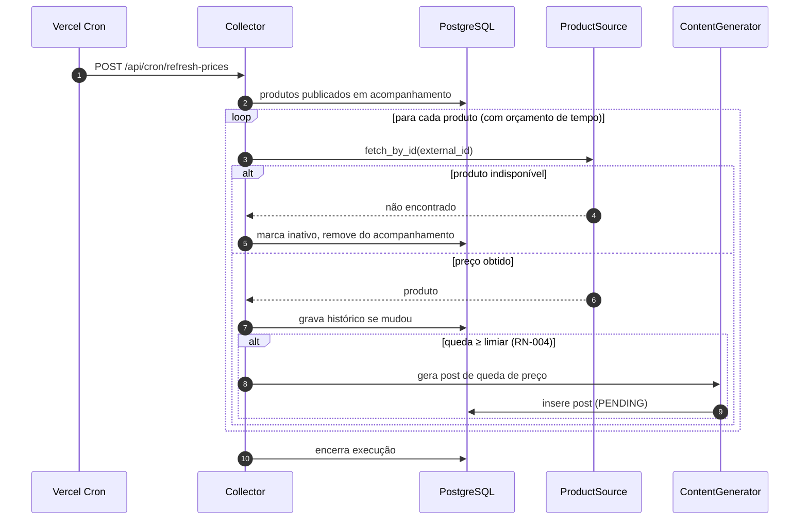

[← 2. Componentes](02-componentes.md) | [Índice da Arquitetura](../ARCHITECTURE.md) | Próximo: [4. Restrições do serverless →](04-restricoes-serverless.md)

---

# 3. Fluxos

Cinco fluxos cobrem toda a operação do sistema. Os diagramas mostram o caminho de sucesso; as observações abaixo de cada um tratam do que acontece quando algo dá errado.

---

## 3.1 Coleta e geração de posts

Implementa UC-01, UC-02 e UC-03.

**Quando dá errado**

| Situação | Resposta do sistema |
|---|---|
| Orçamento de tempo esgotado | Interrompe a paginação, salva o cursor, encerra como `PARTIAL`. A próxima execução retoma |
| Falha de autenticação na fonte | Renova o token uma vez; persistindo, encerra como `FAILED` e alerta |
| Limite de taxa da fonte | Espera exponencial; esgotadas as tentativas, encerra como `PARTIAL` |
| Produto individual malformado | Descarta o item e prossegue; se mais da metade da página falhar, encerra como `FAILED` |
| Função morre no meio | A trava expira sozinha; a execução fica `RUNNING` órfã e é marcada como `FAILED` pela rotina de reconciliação |

---

## 3.2 Aprovação e publicação

Implementa UC-05 e UC-08. É o fluxo com mais partes móveis, porque atravessa duas invocações separadas por uma fila.

**Quando dá errado**

| Situação | Resposta | Código ao QStash |
|---|---|---|
| Assinatura inválida | Não processa | 401 |
| Limite de taxa do Telegram | Solicita nova tentativa após o intervalo indicado | 429 |
| Erro temporário do Telegram | Solicita nova tentativa | 500 |
| Erro permanente (bot removido, formatação inválida) | Marca `FAILED`, alerta o Administrador | 200 — interrompe retentativas |
| Retentativas esgotadas | QStash envia à fila de mensagens mortas; post vira `FAILED` | — |
| Post em estado inesperado | Registra e ignora | 200 |

> Responder **200 em erro permanente** é contraintuitivo, mas correto: sinaliza ao QStash que não adianta insistir. Retentar um envio que sempre falhará só gasta cota e polui os registros. O erro fica visível no painel, não na fila.

---

## 3.3 Publicação manual no Twitter/X

Implementa UC-09.

O sistema não tem como confirmar que a publicação realmente ocorreu — depende da marcação do Administrador. Esse é o custo aceito por não contratar a API do X (RE-04). O campo de URL do tuíte existe para que exista ao menos um vestígio verificável.

---

## 3.4 Clique e redirecionamento

Implementa UC-10. É o fluxo mais sensível a latência do sistema.

**Decisões de projeto**

| Decisão | Motivo |
|---|---|
| Cache do código no Redis | Evita ida ao banco no caminho crítico (RNF-004) |
| Redirecionamento antes do registro | O clique é métrica; a conversão é o produto (RNF-012) |
| Sem autenticação | Precisa funcionar mesmo com o painel fora do ar (RNF-013) |
| Contador no Redis, detalhe no Postgres | Leitura rápida para o painel, detalhe para análise |
| Parâmetro `src` na URL | Distingue Telegram de Twitter/X (RF-045) |

Se o registro do clique falhar, o visitante não percebe. Se o redirecionamento falhar, perde-se uma venda. A assimetria justifica toda a estrutura acima.

---

## 3.5 Reavaliação de preços

Implementa UC-15.

Este fluxo reaproveita `Collector` e `ContentGenerator` sem alteração — a única diferença é a origem da lista de produtos e o template escolhido. É o retorno concreto de ter mantido a curadoria e a geração desacopladas da coleta.

---

## 3.6 Resumo dos gatilhos

| Fluxo | Gatilho | Frequência sugerida | Endpoint |
|---|---|---|---|
| Coleta | Vercel Cron | 3× ao dia | `/api/cron/collect` |
| Reavaliação de preços | Vercel Cron | 1× ao dia | `/api/cron/refresh-prices` |
| Expiração de pendentes | Vercel Cron | 1× ao dia | `/api/cron/expire-pending` |
| Agregação de métricas | Vercel Cron | 1× ao dia | `/api/cron/aggregate-metrics` |
| Publicação | QStash | Por aprovação | `/api/jobs/publish` |
| Aprovação | Administrador | Sob demanda | `/api/posts/{id}/approve` |
| Redirecionamento | Assinante | Sob demanda | `/r/{code}` |

Os horários concretos e a sintaxe de agendamento estão em [`SETUP.md`](../SETUP.md).

---

[← 2. Componentes](02-componentes.md) | [Índice da Arquitetura](../ARCHITECTURE.md) | Próximo: [4. Restrições do serverless →](04-restricoes-serverless.md)
