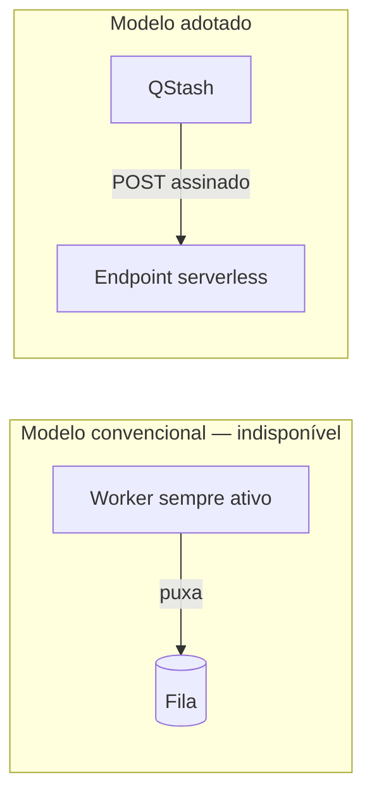

[← 3. Fluxos](03-fluxos.md) | [Índice da Arquitetura](../ARCHITECTURE.md) | Próximo: [5. Segurança e observabilidade →](05-seguranca-observabilidade.md)

---

# 4. Restrições do Serverless

Esta seção existe porque a maior parte dos tutoriais de bot de Telegram assume um processo que fica ligado. Nada disso funciona aqui. O que segue é o inventário dos padrões que **não** podem ser usados e o que os substitui.

---

## 4.1 O que muda

| Padrão convencional | Por que não funciona | Substituto adotado |
|---|---|---|
| `bot.polling()` — long polling | Exige processo permanentemente ativo | **Webhook**: o Telegram chama um endpoint |
| `APScheduler`, `schedule`, `cron` em processo | O agendador morre junto com a função | **Vercel Cron** invocando endpoints |
| Worker consumindo fila (`BullMQ`, `Celery`, `RQ`) | Exige processo escutando a fila | **QStash**: a fila chama um endpoint |
| Cache em variável global | Cada invocação pode ser uma instância nova | **Redis** (Upstash) |
| Sessão em memória | Idem | **Supabase Auth** com token |
| Pool de conexões persistente | Conexões não sobrevivem entre invocações | **Connection pooler** do Supabase |
| `asyncio.create_task` sem aguardar | A função encerra antes da tarefa terminar | `waitUntil` ou execução antes de responder |
| Processamento longo em uma chamada | Tempo máximo de execução | **Fatiamento com cursor** e retomada |
| Estado de progresso em memória | Perdido a cada invocação | Cursor persistido no banco |

---

## 4.2 Telegram por webhook

O bot **não** faz polling. O Telegram é quem chama o sistema.

| Aspecto | Definição |
|---|---|
| Endpoint | `POST /api/webhooks/telegram` |
| Registro | Chamada única a `setWebhook` no provisionamento |
| Autenticação | Cabeçalho `X-Telegram-Bot-Api-Secret-Token`, comparado ao segredo configurado |
| Resposta | Sempre 200 e rápida; processamento pesado é enfileirado |

Na versão 1 o bot só publica — não responde a comandos. O webhook existe para receber confirmações e eventos administrativos do grupo. Ainda assim, ele é registrado desde o início: descobrir depois que a arquitetura pressupunha polling seria uma reescrita.

---

## 4.3 Agendamento por Vercel Cron

Cada tarefa periódica é um endpoint HTTP invocado pela plataforma.

**Proteção obrigatória.** Endpoints de cron são acessíveis pela internet. Todos verificam um segredo antes de qualquer efeito colateral (RNF-027). Sem isso, qualquer pessoa poderia disparar coletas à vontade.

```python
def assert_cron_authorized(request) -> None:
    provided = request.headers.get("authorization", "")
    expected = f"Bearer {settings.CRON_SECRET}"
    if not hmac.compare_digest(provided, expected):
        raise HTTPException(401)
```

A comparação usa `compare_digest` para não vazar informação por tempo de resposta.

**Granularidade limitada.** O agendamento tem resolução de minutos, e o plano gratuito impõe limite ao número de tarefas. O sistema usa quatro (coleta, reavaliação, expiração, agregação) — se o limite apertar, várias podem ser fundidas em um único endpoint despachante.

---

## 4.4 Fila por push HTTP

O QStash inverte a relação convencional: em vez de o sistema puxar da fila, a fila empurra para o sistema.



| Aspecto | Definição |
|---|---|
| Enfileirar | `POST` à API do QStash com a URL de destino e o corpo do job |
| Entregar | O QStash chama a URL com assinatura no cabeçalho |
| Retentar | Automático, com espera exponencial |
| Agendar | Parâmetro de atraso na publicação do job |
| Falha final | Fila de mensagens mortas |

**Semântica de entrega ao menos uma vez.** O QStash pode entregar o mesmo job mais de uma vez — por retentativa após um erro de rede que na verdade teve sucesso, por exemplo. Por isso a idempotência não é refinamento, é requisito (RF-034, RNF-015). Sem ela, o grupo receberia mensagens duplicadas.

**O código de resposta é o protocolo.** O endpoint comunica sua intenção ao QStash pelo status HTTP: 2xx encerra o job, 4xx e 5xx provocam retentativa. É por isso que erro permanente responde 200 — ver seção 3.2.

---

## 4.5 Orçamento de tempo

Toda operação que percorre coleções precisa saber quanto tempo lhe resta.

```python
class TimeBudget:
    def __init__(self, limit_seconds: float, safety_margin: float = 0.20):
        self.deadline = time.monotonic() + limit_seconds * (1 - safety_margin)

    def has_room_for(self, estimated_seconds: float) -> bool:
        return time.monotonic() + estimated_seconds < self.deadline
```

A margem de 20% (RNF-001) cobre o encerramento ordenado: gravar o cursor, fechar o registro de execução, liberar a trava. Sem essa reserva, a função seria interrompida no meio da escrita e deixaria estado inconsistente.

**Padrão de retomada**

1. Carregar o cursor da execução anterior, se houver
2. Processar enquanto houver tempo e páginas
3. Ao esgotar o tempo, gravar o cursor e encerrar como `PARTIAL`
4. A execução seguinte retoma do cursor

Esse padrão vale para coleta, reavaliação de preços e agregação de métricas.

---

## 4.6 Conexões com o banco

Funções serverless podem escalar horizontalmente de forma abrupta, e cada instância abrindo conexões diretas esgotaria o limite do Postgres.

| Prática | Motivo |
|---|---|
| Usar o pooler do Supabase em modo transação | Uma conexão física serve muitas invocações |
| Pool pequeno por instância (1 a 2 conexões) | Cada instância atende uma requisição por vez |
| Não usar `prepared statements` de sessão | Incompatível com o modo transação do pooler |
| Fechar a conexão ao fim da requisição | Não há próxima requisição na mesma instância garantida |

---

## 4.7 Cold start

A primeira invocação após um período de inatividade tem latência adicional.

| Fluxo | Sensível? | Tratamento |
|---|---|---|
| Redirecionamento `/r/{code}` | Sim — RNF-004 | Função enxuta, sem dependências pesadas; região próxima ao banco |
| Publicação | Não | Assíncrona; o prazo de 60 s de RNF-006 absorve a latência |
| Coleta | Não | Executa em segundo plano |
| Painel | Pouco | Aceitável para uso administrativo |

**Medida principal:** manter a função de redirecionamento com o menor conjunto possível de dependências importadas. Cada biblioteca carregada no topo do arquivo entra no tempo de inicialização — e essa função não precisa de nenhuma delas.

---

## 4.8 Ausência de transação distribuída

Não existe transação abrangendo Postgres e QStash. As operações que tocam ambos precisam de estratégia explícita.

**Aprovação de post**

```
1. Postgres: PENDING → APPROVED
2. QStash: enfileirar job
3. Se (2) falhar → Postgres: APPROVED → PENDING
```

Janela de risco: a função morre entre 1 e 2. Resultado: post `APPROVED` sem job. Detecção: rotina de reconciliação que busca posts `APPROVED` há mais de N minutos sem publicação e os reenfileira.

**Publicação**

```
1. Verificar chave de idempotência
2. Enviar ao Telegram
3. Postgres: APPROVED → PUBLISHED
```

Janela de risco: a função morre entre 2 e 3. Resultado: mensagem publicada, post ainda `APPROVED`. Na reentrega, o passo 1 detecta a chave e responde sucesso. A reconciliação corrige o status consultando a mensagem no grupo.

> A escolha aqui foi tolerar inconsistência de curta duração e detectá-la, em vez de tentar garantir consistência forte entre sistemas que não a oferecem. Reconciliação periódica é mais simples e mais robusta do que um protocolo de duas fases improvisado.

---

## 4.9 Checklist de conformidade

Antes de aceitar qualquer código no projeto:

- [ ] Não há laço infinito, `while True` ou `sleep` prolongado
- [ ] Não há estado em variável global entre requisições
- [ ] Não há agendador em processo
- [ ] Toda operação sobre coleção respeita orçamento de tempo
- [ ] Todo endpoint público valida segredo ou assinatura
- [ ] Toda operação com efeito externo é idempotente
- [ ] Nenhuma tarefa em segundo plano é criada sem garantia de execução
- [ ] Conexões de banco são fechadas ao fim da requisição

---

[← 3. Fluxos](03-fluxos.md) | [Índice da Arquitetura](../ARCHITECTURE.md) | Próximo: [5. Segurança e observabilidade →](05-seguranca-observabilidade.md)
