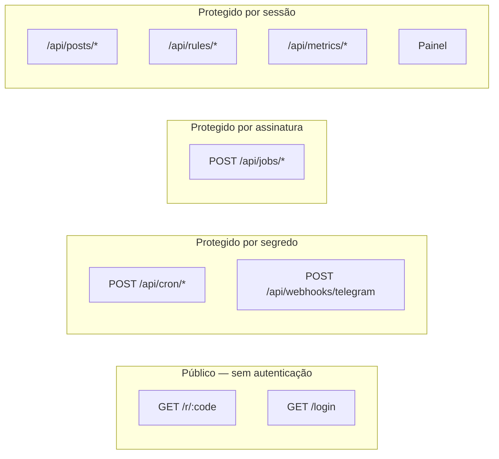

[← 4. Restrições do serverless](04-restricoes-serverless.md) | [Índice da Arquitetura](../ARCHITECTURE.md)

---

# 5. Segurança e Observabilidade

---

## 5.1 Superfície de exposição



| Endpoint | Controle | Se falhar | Requisito |
|---|---|---|---|
| `GET /r/:code` | Nenhum, por desenho | — | RF-043 |
| `GET /login` | Limite de frequência por e-mail e origem | 429 | UC-12 E3 |
| `POST /api/cron/*` | Segredo em cabeçalho, comparado em tempo constante | 401 | RNF-027 |
| `POST /api/webhooks/telegram` | Token secreto do webhook | 401 | RNF-027 |
| `POST /api/jobs/*` | Assinatura do QStash | 401 | RF-035 |
| Demais rotas | Sessão validada no servidor | 401 | RNF-025 |

---

## 5.2 Autenticação e autorização

**Autenticação** por link mágico do Supabase Auth: o usuário informa o e-mail e recebe um link de acesso. Sem senha para vazar, reutilizar ou esquecer.

**Autorização** por lista de e-mails permitidos, verificada no servidor antes do envio do link. A resposta ao usuário é idêntica para endereços autorizados e não autorizados (RNF-026) — revelar a diferença permitiria enumerar quem tem acesso.

**Validação no servidor, sempre.** O painel verifica a sessão para decidir o que renderizar, mas essa verificação é conveniência de interface. Toda rota de API valida a sessão de novo, por conta própria. Uma requisição direta ao endpoint, sem passar pelo painel, é recusada.

**Papéis.** A versão 1 tem um único papel implícito, o de Administrador. A estrutura de dados já prevê o campo de papel para acomodar o Revisor (AT-02) sem migração destrutiva.

---

## 5.3 Proteção de dados

| Dado | Classificação | Tratamento |
|---|---|---|
| Credenciais de serviços externos | Secreto | Apenas em variáveis de ambiente; nunca no repositório, em registros ou em respostas |
| Sessão do usuário | Sensível | Cookie `HttpOnly`, `Secure`, `SameSite=Lax` |
| E-mail do administrador | Pessoal | Armazenado no Supabase Auth; não replicado nas tabelas de aplicação |
| Endereço de origem do clique | Pessoal | **Não armazenado em texto claro.** Convertido em identificador não reversível por função de resumo com sal, para deduplicação (RN-024) |
| Agente de usuário | Pouco sensível | Reduzido a categoria de dispositivo antes do armazenamento |
| Dados de produto | Público | Sem restrição |

**Sobre o identificador de visitante.** A deduplicação de cliques exige distinguir visitantes, não identificá-los. Armazenar `hash(ip + user_agent + sal_diário)` resolve o problema de negócio sem manter dado pessoal recuperável. O sal rotativo diário limita a janela de correlação.

**Segurança em nível de linha.** Todas as tabelas têm RLS habilitada (RNF-029). A chave pública do Supabase, exposta ao navegador, não concede leitura de nenhuma tabela administrativa. O acesso do backend usa a chave de serviço, que nunca sai do servidor.

---

## 5.4 Ameaças consideradas

| Ameaça | Vetor | Mitigação |
|---|---|---|
| Disparo não autorizado de coleta | Chamada direta ao endpoint de cron | Segredo obrigatório (RNF-027) |
| Publicação forjada no grupo | Chamada direta ao endpoint de job | Assinatura do QStash (RF-035) |
| Enumeração de ofertas | Adivinhação sequencial de códigos curtos | Códigos aleatórios não sequenciais (RF-042) |
| Enumeração de contas | Diferença de resposta no login | Resposta uniforme (RNF-026) |
| Vazamento de credencial | Segredo cometido no repositório | Varredura na integração contínua (RNF-028) |
| Injeção de formatação no Telegram | Título de produto com caractere reservado | Escaping centralizado no `ContentGenerator` (RF-016) |
| Abuso do redirecionador | Volume artificial de cliques | Limite de frequência por origem e marcação de tráfego automatizado |
| Redirecionamento aberto | Código apontando para destino arbitrário | Destinos só são criados pelo sistema, nunca por entrada do usuário |
| Injeção de SQL | Parâmetros de consulta | Consultas parametrizadas, sem concatenação de string |

**Redirecionamento aberto merece atenção.** O encurtador é, por natureza, um mecanismo de redirecionamento. O que impede que vire ferramenta de phishing é que nenhuma entrada de usuário jamais define a URL de destino — ela vem sempre do `ProductSource`. Se algum dia o painel permitir criar links manualmente, será preciso adicionar validação de domínio permitido.

---

## 5.5 Registros

**Formato estruturado**, um objeto por evento, com identificador de correlação que atravessa todo o percurso de um post (RNF-030).

```json
{
  "ts": "2026-08-08T14:32:11Z",
  "level": "info",
  "event": "post.published",
  "correlation_id": "run_01J8X...",
  "post_id": "pst_01J8X...",
  "product_id": "prd_01J8X...",
  "channel": "telegram",
  "duration_ms": 412
}
```

### Eventos registrados

| Evento | Nível | Campos adicionais |
|---|---|---|
| `collect.started` | info | `run_id`, `source` |
| `collect.page_fetched` | debug | `cursor`, `count` |
| `collect.finished` | info | `status`, contagens |
| `curation.rejected` | debug | `product_id`, `reason` |
| `content.generated` | info | `post_id`, `template` |
| `post.approved` | info | `post_id`, `actor` |
| `post.rejected` | info | `post_id`, `reason`, `actor` |
| `post.published` | info | `post_id`, `message_id` |
| `post.failed` | error | `post_id`, `error`, `attempt` |
| `click.recorded` | debug | `code`, `src`, `is_unique` |
| `auth.denied` | warn | `email_hash`, `reason` |

**O que nunca aparece nos registros:** credenciais, tokens, e-mails em texto claro, endereços de origem completos, conteúdo integral das mensagens.

---

## 5.6 Alertas

| Condição | Severidade | Ação |
|---|---|---|
| Post em `FAILED` | Alta | Notificar o Administrador (RF-038) |
| Coleta encerrada como `FAILED` | Alta | Notificar |
| Duas coletas seguidas com zero produtos aprovados | Média | Notificar — provável excesso de restrição nas regras |
| Fila de mensagens mortas não vazia | Alta | Notificar |
| Fila vazia por mais de 24 h | Baixa | Notificar |
| Falha de autenticação na fonte | Alta | Notificar — provável credencial expirada |

**Canal de notificação:** chat privado do próprio bot com o Administrador. Não exige serviço adicional e chega ao celular — que é onde o Administrador está quando algo quebra.

---

## 5.7 Reconciliação

Rotina diária que detecta as inconsistências previstas na seção 4.8.

| Verificação | Correção |
|---|---|
| Posts `APPROVED` há mais de 15 minutos sem publicação | Reenfileirar job |
| Execuções `RUNNING` há mais de 1 hora | Marcar como `FAILED` |
| Posts `PENDING` além do prazo de expiração | Marcar como `EXPIRED` (RN-009) |
| Links curtos sem post associado | Desativar |
| Contadores do Redis divergentes do Postgres | Recalcular a partir do Postgres |

O Postgres é sempre a fonte de verdade. O Redis é cache e pode ser reconstruído; se divergir, ele é quem está errado.

---

## 5.8 Indicadores de saúde

| Indicador | Meta | Origem |
|---|---|---|
| Execuções de coleta bem-sucedidas | ≥ 95% | Tabela de execuções |
| Publicações bem-sucedidas na primeira tentativa | ≥ 98% | Tabela de posts |
| Latência do redirecionamento (p95) | ≤ 300 ms | Métricas da plataforma |
| Tempo entre aprovação e publicação (p95) | ≤ 60 s | Diferença entre horários registrados |
| Posts pendentes | Entre 5 e 60 | Consulta à fila |
| Custo mensal | R$ 0 | Faturas dos serviços |

Fora das metas por três dias seguidos, o indicador vira tarefa de investigação.

---

[← 4. Restrições do serverless](04-restricoes-serverless.md) | [Índice da Arquitetura](../ARCHITECTURE.md)
