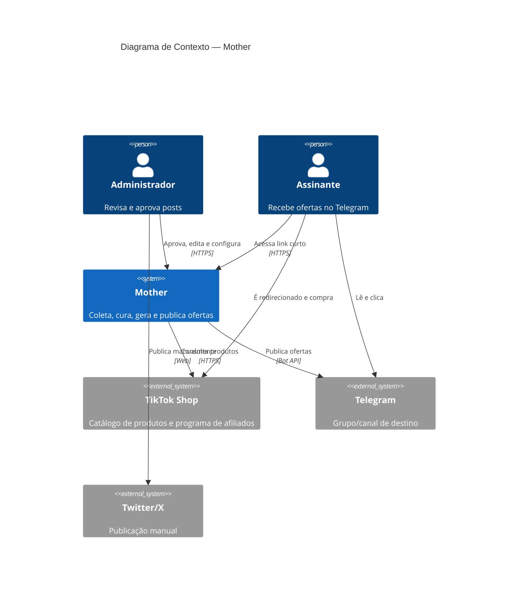
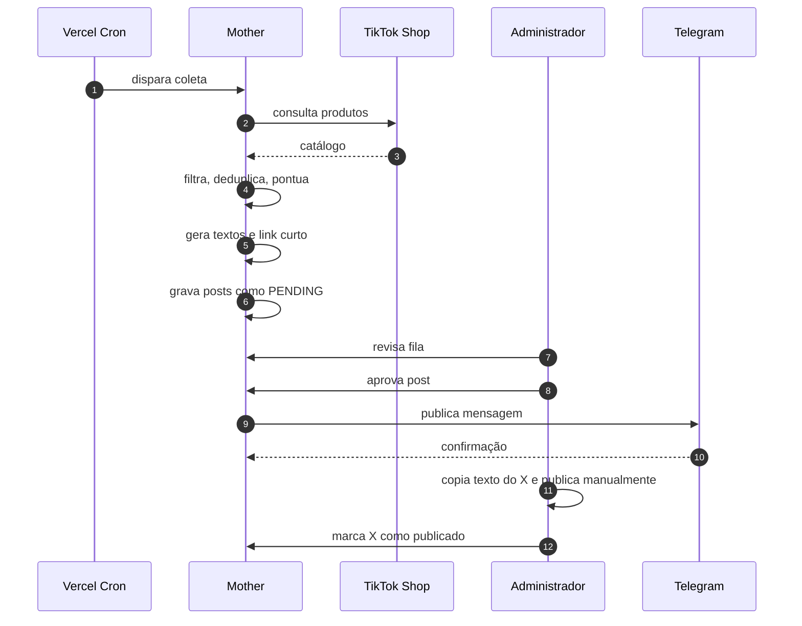

[← 1. Introdução](01-introducao.md) | [Índice do SRS](../SRS.md) | Próximo: [3. Casos de Uso →](03-casos-de-uso.md)

---

# 2. Visão Geral do Sistema

## 2.1 Perspectiva do produto

O Mother é um sistema novo e autocontido. Ele não substitui nem se integra a nenhum sistema legado. Sua posição é a de um intermediário entre uma fonte de catálogo (TikTok Shop) e canais de distribuição (Telegram e Twitter/X), com um ponto de controle humano no meio.

## 2.2 Atores

### 2.2.1 Atores humanos

| ID | Ator | Descrição | Frequência de uso |
|---|---|---|---|
| **AT-01** | **Administrador** | Único usuário operacional na versão 1. Revisa a fila, aprova, rejeita e edita posts, configura regras de curadoria e consulta métricas. Detém todas as permissões. | Diária, sessões curtas |
| **AT-02** | **Revisor** | Papel previsto para expansão futura: pode aprovar e rejeitar, mas não altera configurações nem credenciais. Não implementado no MVP. | — |
| **AT-03** | **Assinante** | Membro do grupo do Telegram. Não interage com o sistema diretamente; consome os posts e clica nos links. É ator indireto. | Passiva, contínua |
| **AT-04** | **Seguidor no X** | Equivalente ao AT-03 no Twitter/X. | Passiva, contínua |

### 2.2.2 Atores de sistema

| ID | Ator | Papel |
|---|---|---|
| **AT-05** | **Agendador (Vercel Cron)** | Dispara a coleta periódica e a reavaliação de preços em horários definidos |
| **AT-06** | **TikTok Shop API** | Fornece o catálogo de produtos, preços e links de afiliado |
| **AT-07** | **Telegram Bot API** | Recebe e entrega as mensagens ao grupo de destino |
| **AT-08** | **QStash** | Entrega jobs de publicação ao sistema via HTTP push, com retentativa automática |
| **AT-09** | **Supabase** | Persistência de dados e autenticação do painel |

## 2.3 Funcionalidades principais

| Módulo | Responsabilidade | Casos de uso |
|---|---|---|
| **Coletor** | Buscar produtos na fonte configurada, de forma paginada e resiliente | UC-01 |
| **Curadoria** | Filtrar, pontuar e deduplicar candidatos | UC-02, UC-11, UC-15 |
| **Gerador de conteúdo** | Renderizar os textos de Telegram e Twitter/X a partir de templates | UC-03 |
| **Fila e aprovação** | Manter o estado dos posts e mediar a decisão humana | UC-04, UC-05, UC-06, UC-07 |
| **Publicador Telegram** | Entregar o post ao grupo e registrar o resultado | UC-08, UC-14 |
| **Fila Twitter/X** | Disponibilizar o texto para cópia e registrar a publicação manual | UC-09 |
| **Encurtador** | Gerar códigos curtos, registrar cliques e redirecionar | UC-10 |
| **Painel** | Interface de operação e autenticação | UC-12, UC-13 |

## 2.4 Premissas

| ID | Premissa | Impacto se falsa |
|---|---|---|
| **PR-01** | O Administrador acessa o painel ao menos uma vez ao dia para revisar a fila | Posts pendentes expiram (RN-009) e o canal fica sem conteúdo |
| **PR-02** | O volume de produtos coletados por execução é da ordem de centenas, não de dezenas de milhares | A coleta pode estourar o tempo limite da função serverless; exigiria paginação por múltiplas invocações |
| **PR-03** | O acesso à API do TikTok Shop será obtido em algum momento | Sem fonte de dados o produto não existe; mitigado por `MockSource` durante o desenvolvimento |
| **PR-04** | O grupo do Telegram é de propriedade do Administrador e o bot é administrador dele | O bot não consegue publicar |
| **PR-05** | O volume de cliques nos links curtos é baixo o suficiente para caber no plano gratuito do Supabase | Necessidade de upgrade de plano ou de agregação de cliques |
| **PR-06** | O programa de afiliados do TikTok Shop permanece disponível na região de operação | Perda do modelo de monetização; o sistema continua funcional apenas como divulgação |
| **PR-07** | Um único administrador opera o sistema na versão 1 | Necessidade antecipada do papel AT-02 e de controle de concorrência na fila |

## 2.5 Restrições

| ID | Restrição | Origem | Consequência de projeto |
|---|---|---|---|
| **RE-01** | Não é possível manter processos de longa duração | Vercel serverless | Telegram por webhook; agendamento por Cron; fila por push HTTP. Ver [ADR-0002](../adr/0002-plataforma-serverless-vercel.md) |
| **RE-02** | Funções serverless têm tempo máximo de execução | Vercel | Coleta deve ser fatiada e retomável; nenhuma operação pode depender de rodar por minutos |
| **RE-03** | Sem estado em memória entre invocações | Serverless | Todo estado vive no Supabase ou no Redis |
| **RE-04** | A API do Twitter/X não será contratada | Decisão de custo | Publicação no X é obrigatoriamente manual |
| **RE-05** | O acesso à API do TikTok Shop depende de aprovação externa | TikTok Partner Center | Prazo fora de controle; exige abstração `ProductSource` e implementação mock |
| **RE-06** | Limites de taxa do Telegram Bot API | Telegram | Cadência de publicação limitada; necessidade de espaçamento entre envios |
| **RE-07** | Backend em Python, painel em Next.js | Decisão de stack do time | Projeto com duas runtimes no mesmo deploy. Ver [ADR-0004](../adr/0004-stack-hibrida-python-nextjs.md) |
| **RE-08** | Orçamento inicial próximo de zero | Projeto pessoal | Uso obrigatório de camadas gratuitas; arquitetura deve caber nos limites delas |
| **RE-09** | Conteúdo publicado deve respeitar as políticas de divulgação de afiliados | Legal | Posts devem sinalizar a natureza comercial do link (RN-021) |

## 2.6 Dependências externas

| Dependência | Criticidade | Se ficar indisponível |
|---|---|---|
| TikTok Shop API | Crítica | A coleta falha; a fila esvazia com o tempo. Posts já enfileirados continuam publicáveis |
| Telegram Bot API | Crítica | Publicação falha e o job é retentado pelo QStash (RF-033) |
| Supabase | Crítica | O sistema inteiro para |
| Upstash QStash | Alta | Aprovações não disparam publicação; jobs ficam retidos até a recuperação |
| Vercel | Crítica | Painel e funções ficam fora do ar |

## 2.7 Ambiente operacional

| Aspecto | Definição |
|---|---|
| Execução | Funções serverless em nuvem (Vercel) |
| Runtime backend | Python 3.12 |
| Runtime frontend | Node.js / Next.js |
| Banco de dados | PostgreSQL gerenciado (Supabase) |
| Navegadores suportados | Versões atuais de Chrome, Firefox, Safari e Edge |
| Dispositivos do painel | Desktop e mobile (layout responsivo) |
| Idioma da interface e do conteúdo | Português do Brasil |
| Fuso horário de referência | America/Sao_Paulo |

## 2.8 Fluxo de valor resumido

---

[← 1. Introdução](01-introducao.md) | [Índice do SRS](../SRS.md) | Próximo: [3. Casos de Uso →](03-casos-de-uso.md)
