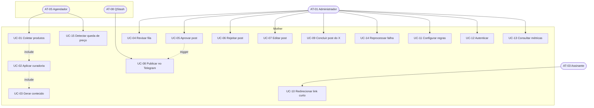

[← 2. Visão Geral](02-visao-geral.md) | [Índice do SRS](../SRS.md) | Próximo: [3a. Coleta e Curadoria →](03a-uc-coleta-curadoria.md)

---

# 3. Casos de Uso — Índice

Os 15 casos de uso estão agrupados em quatro arquivos por afinidade funcional.

| Arquivo | Casos de uso |
|---|---|
| [3a. Coleta e Curadoria](03a-uc-coleta-curadoria.md) | UC-01, UC-02, UC-03, UC-15 |
| [3b. Aprovação](03b-uc-aprovacao.md) | UC-04, UC-05, UC-06, UC-07 |
| [3c. Publicação](03c-uc-publicacao.md) | UC-08, UC-09, UC-14 |
| [3d. Plataforma](03d-uc-plataforma.md) | UC-10, UC-11, UC-12, UC-13 |

---

## 3.1 Diagrama de casos de uso

---

## 3.2 Resumo dos casos de uso

| ID | Nome | Ator primário | Gatilho | Prioridade |
|---|---|---|---|---|
| UC-01 | Coletar produtos da fonte | AT-05 Agendador | Cron programado | Must |
| UC-02 | Aplicar curadoria e deduplicação | Sistema | Fim da coleta | Must |
| UC-03 | Gerar conteúdo dos posts | Sistema | Aprovação na curadoria | Must |
| UC-04 | Revisar fila de aprovação | AT-01 Administrador | Acesso ao painel | Must |
| UC-05 | Aprovar post | AT-01 Administrador | Decisão do revisor | Must |
| UC-06 | Rejeitar post | AT-01 Administrador | Decisão do revisor | Must |
| UC-07 | Editar texto do post | AT-01 Administrador | Antes de aprovar | Should |
| UC-08 | Publicar no Telegram | AT-08 QStash | Job de publicação | Must |
| UC-09 | Concluir post do Twitter/X | AT-01 Administrador | Após publicar manualmente | Must |
| UC-10 | Redirecionar link curto e registrar clique | AT-03 Assinante | Clique no link | Must |
| UC-11 | Configurar regras de curadoria | AT-01 Administrador | Necessidade de ajuste | Should |
| UC-12 | Autenticar no painel | AT-01 Administrador | Acesso ao painel | Must |
| UC-13 | Consultar métricas de cliques | AT-01 Administrador | Análise de desempenho | Should |
| UC-14 | Reprocessar publicação com falha | AT-01 Administrador | Post em estado `FAILED` | Should |
| UC-15 | Detectar queda de preço e reenfileirar | AT-05 Agendador | Cron programado | Could |

---

## 3.3 Template de especificação

Todos os casos de uso seguem a mesma estrutura:

| Campo | Significado |
|---|---|
| **Ator primário** | Quem inicia o caso de uso |
| **Atores secundários** | Sistemas ou pessoas envolvidos, mas que não iniciam |
| **Pré-condições** | O que precisa ser verdade antes de começar |
| **Pós-condições** | O que passa a ser verdade após o sucesso |
| **Gatilho** | Evento que dispara a execução |
| **Fluxo principal** | Caminho de sucesso, passo a passo |
| **Fluxos alternativos** | Variações válidas que também levam ao sucesso |
| **Fluxos de exceção** | Caminhos de erro e como o sistema reage |
| **Requisitos relacionados** | RF, RN e RNF envolvidos |

---

[← 2. Visão Geral](02-visao-geral.md) | [Índice do SRS](../SRS.md) | Próximo: [3a. Coleta e Curadoria →](03a-uc-coleta-curadoria.md)
