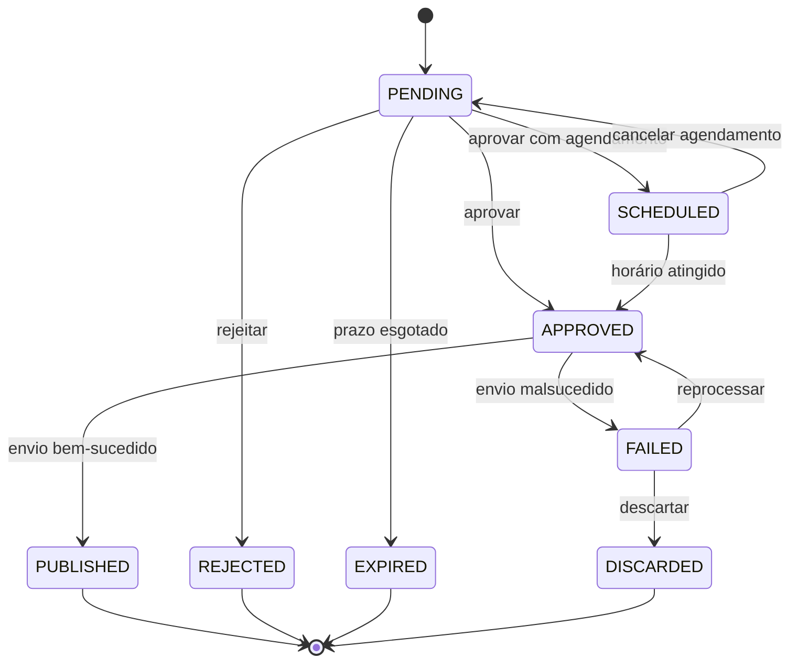

[← 5. Requisitos Não Funcionais](05-requisitos-nao-funcionais.md) | [Índice do SRS](../SRS.md) | Próximo: [7. Rastreabilidade →](07-rastreabilidade.md)

---

# 6. Regras de Negócio

24 regras que definem o comportamento do domínio. A coluna **Configurável** indica se o valor pode ser alterado pelo painel (UC-11) ou se está fixo no código.

---

## 6.1 Curadoria

### RN-001 — Desconto mínimo
Só entram na fila produtos com desconto igual ou superior ao percentual configurado.
**Valor padrão:** 20% · **Configurável:** sim
**Justificativa:** descontos pequenos não sustentam a proposta de um canal de ofertas.

### RN-002 — Faixa de preço
Só entram na fila produtos cujo preço esteja entre os valores mínimo e máximo configurados.
**Valor padrão:** R$ 15,00 a R$ 500,00 · **Configurável:** sim
**Justificativa:** produtos muito baratos rendem comissão irrelevante; muito caros convertem mal em canal de ofertas.

### RN-003 — Janela de reposição
Um produto já publicado só pode voltar à fila após decorridos N dias da última publicação.
**Valor padrão:** 30 dias · **Configurável:** sim
**Exceção:** RN-004.

### RN-004 — Exceção por queda de preço
Um produto publicado dentro da janela de reposição pode retornar à fila se o preço atual for inferior ao preço publicado em pelo menos o percentual configurado.
**Valor padrão:** 15% · **Configurável:** sim
**Complemento:** o post gerado é sinalizado como oferta de queda de preço e usa template próprio (RN-015).

### RN-005 — Cálculo do score
O score é a soma ponderada de quatro componentes normalizados entre 0 e 1: desconto, avaliação média, volume de vendas e recência da coleta.
**Fórmula:** `score = (w_d × desconto) + (w_a × avaliação) + (w_v × vendas) + (w_r × recência)`
**Pesos padrão:** `w_d = 0,40` · `w_a = 0,25` · `w_v = 0,25` · `w_r = 0,10` · **Configurável:** sim
**Restrição:** a soma dos pesos deve ser igual a 1.

### RN-006 — Horários preferenciais de publicação
Publicações agendadas devem ocorrer dentro da janela diária configurada.
**Valor padrão:** das 09h às 22h, fuso America/Sao_Paulo · **Configurável:** sim
**Comportamento:** aprovações fora da janela com agendamento automático são deslocadas para o próximo horário válido.

### RN-007 — Limite diário de publicações
Não podem ser publicados mais do que N posts por dia no Telegram.
**Valor padrão:** 8 · **Configurável:** sim
**Justificativa:** excesso de mensagens gera silenciamento e saída de membros do grupo.

### RN-008 — Limite de itens por execução de coleta
Cada execução de curadoria seleciona no máximo N produtos para virar post.
**Valor padrão:** 20 · **Configurável:** sim

### RN-009 — Expiração de post pendente
Um post que permaneça `PENDING` por mais de N dias é automaticamente marcado como `EXPIRED` e deixa de aparecer na fila.
**Valor padrão:** 3 dias · **Configurável:** sim
**Justificativa:** oferta antiga tende a não existir mais; publicá-la prejudica a credibilidade do canal.

### RN-010 — Teto da fila de pendentes
Se o número de posts `PENDING` atingir o teto configurado, novas coletas não geram posts adicionais até que a fila diminua.
**Valor padrão:** 60 · **Configurável:** sim

### RN-011 — Tratamento de dados ausentes de qualidade
Produto sem avaliação ou sem número de vendas registrado é tratado conforme a política configurada: aceitar, rejeitar ou aceitar com penalidade no score.
**Valor padrão:** aceitar com penalidade · **Configurável:** sim

---

## 6.2 Conteúdo

### RN-012 — Composição obrigatória do post do Telegram
Todo post do Telegram deve conter, no mínimo: título do produto, preço atual, link curto e sinalização de link de afiliado. Preço anterior e percentual de desconto são incluídos quando disponíveis.
**Configurável:** não (a estrutura mínima é fixa; a redação é definida pelo template)

### RN-013 — Truncamento para o Twitter/X
Quando o texto do Twitter/X exceder 280 caracteres, o truncamento incide exclusivamente sobre o título do produto, preservando integralmente preço, desconto, link e sinalização de afiliado. O título truncado termina com reticências.
**Configurável:** não

### RN-014 — Posts sem mídia
Os posts são exclusivamente textuais. Não são enviadas imagens, álbuns nem cards gerados.
**Configurável:** não
**Origem:** decisão de escopo registrada em [ADR-0005](../adr/0005-posts-somente-texto.md).

### RN-015 — Template por tipo de oferta
Existem no mínimo dois templates ativos: oferta comum e queda de preço. O tipo é determinado automaticamente na geração.
**Configurável:** sim (conteúdo dos templates)

### RN-016 — Efeito da rejeição
A rejeição de um post bloqueia o produto correspondente pelo prazo associado ao motivo escolhido.

| Motivo | Prazo de bloqueio |
|---|---|
| Produto ruim | Permanente |
| Preço enganoso | Permanente |
| Categoria indesejada | 180 dias |
| Texto inadequado | Nenhum — o produto pode retornar |
| Duplicado | 90 dias |
| Outro | 90 dias |

**Configurável:** sim

### RN-019 — Palavras bloqueadas
Produtos cujo título contenha qualquer termo da lista de bloqueio são descartados na curadoria. A comparação ignora maiúsculas, minúsculas e acentuação.
**Valor padrão:** lista vazia · **Configurável:** sim

### RN-021 — Sinalização de conteúdo comercial
Todo post publicado deve indicar que o link gera comissão para o publicador.
**Configurável:** sim (o texto da sinalização; a presença é obrigatória)
**Justificativa:** exigência das políticas de divulgação de afiliados e de boas práticas de transparência.

---

## 6.3 Fluxo e estados

### RN-017 — Estados possíveis de um post
Um post transita exclusivamente pelos estados abaixo.

Transições não representadas no diagrama são inválidas e devem ser recusadas pelo sistema.

### RN-018 — Execução única de coleta
Não pode haver duas execuções de coleta simultâneas. A segunda invocação encerra imediatamente sem processar.
**Configurável:** não

### RN-020 — Início da contagem da janela de reposição
A janela de reposição (RN-003) começa a contar a partir da publicação efetiva no Telegram, não da aprovação.
**Configurável:** não

### RN-022 — Idempotência da publicação
Cada job de publicação carrega uma chave de idempotência derivada do identificador do post e da tentativa. Um job com chave já processada retorna sucesso sem novo envio.
**Configurável:** não

### RN-023 — Independência entre canais
Telegram e Twitter/X são canais independentes: um post pode ser publicado em um e dispensado no outro. O estado de um canal não determina o do outro.
**Configurável:** não

### RN-024 — Deduplicação de cliques
Cliques originados do mesmo visitante para o mesmo código dentro da janela configurada contam como um único clique único, embora todos sejam registrados individualmente.
**Valor padrão:** 24 horas · **Configurável:** sim
**Identificação do visitante:** derivada de forma não reversível a partir do endereço de origem e do agente de usuário, sem armazenar dados pessoais em texto claro.

---

## 6.4 Tabela consolidada de parâmetros

| Regra | Parâmetro | Padrão | Configurável |
|---|---|---|---|
| RN-001 | Desconto mínimo | 20% | Sim |
| RN-002 | Preço mínimo / máximo | R$ 15 / R$ 500 | Sim |
| RN-003 | Janela de reposição | 30 dias | Sim |
| RN-004 | Queda de preço mínima | 15% | Sim |
| RN-005 | Pesos do score | 0,40 / 0,25 / 0,25 / 0,10 | Sim |
| RN-006 | Janela horária de publicação | 09h–22h | Sim |
| RN-007 | Limite diário de publicações | 8 | Sim |
| RN-008 | Itens por execução | 20 | Sim |
| RN-009 | Expiração de pendente | 3 dias | Sim |
| RN-010 | Teto da fila | 60 | Sim |
| RN-011 | Política de dados ausentes | Aceitar com penalidade | Sim |
| RN-016 | Prazos de bloqueio por motivo | Ver tabela | Sim |
| RN-019 | Palavras bloqueadas | Vazio | Sim |
| RN-021 | Texto da sinalização comercial | Padrão do template | Sim |
| RN-024 | Janela de clique único | 24 horas | Sim |

---

[← 5. Requisitos Não Funcionais](05-requisitos-nao-funcionais.md) | [Índice do SRS](../SRS.md) | Próximo: [7. Rastreabilidade →](07-rastreabilidade.md)
